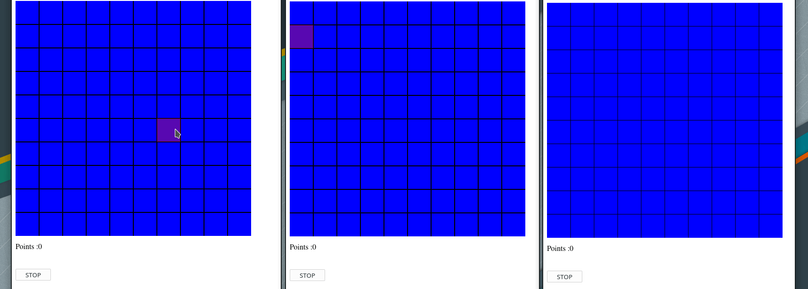

# FindTreasure

Simple game written in NodeJS.

Player objective is to collect the most points. The points can be found on map by reveling the tiles.

Under the tiles players can find 
- Nothing [0]
- Treasure [1-9]
- Monster [P]

When player find moster he lose all points and his life.

The game ends when all players click stop button or loses there lifes.

